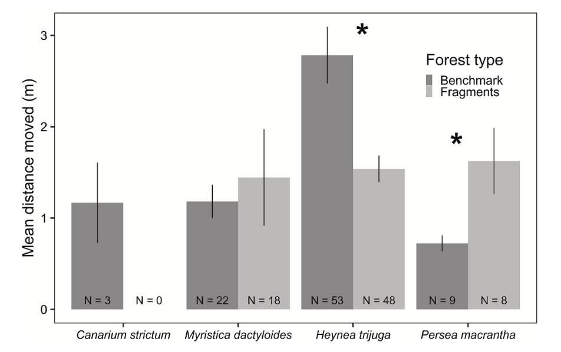
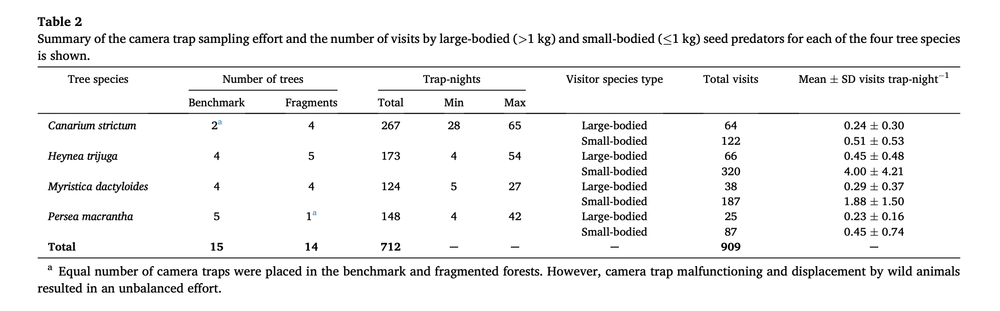
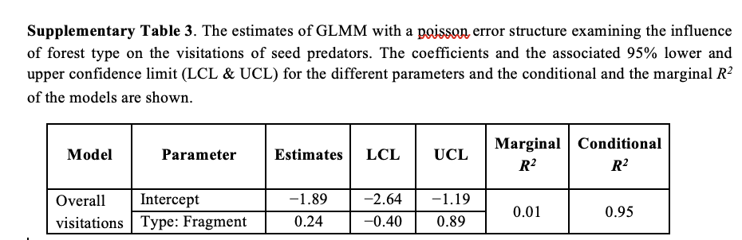

```{r setup, include=FALSE}
knitr::opts_chunk$set(echo = TRUE)
```


### Loading the Required Packages
```{r message=FALSE, warning=FALSE}
library(readr) 
library(ggplot2) 
library(dplyr) 
library(tidyverse)
library(curl) 
```


# Introduction
The published article, "Seed fates of four rainforest tree species in the fragmented forests of Anamalais in the southern Western Ghats, India" by Abhishek Gopala, Divya Mudappa, TR Shankar Raman, Rohit Naniwadekar publishes data on the seed fates of four different tree species in fragmented forests in India. The tree species include: Canarium strictum, Heynea trijuga, Myristica dactyloides, and Persea macrantha. In the article, it describes how seed predation is key in controlling plant population and the structure within forests. Forest fragmentation and habitat loss is directly correlated with seed predation and altered tree recruitment. This article examines four different rainforest tree species and the influence of forest type: benchmark N=3, fragmented N=5, and seed size on the proportion of seeds: 1) predated by vertebrate seed predators, 2) predated by invertebrate seed predators, and 3) removed by vertebrate seed predators. The seeds were tracked by putting seeds in four 1x1 meter plots under each canopy type. Camera traps were placed under a subset of trees N=29 and there was a total of N=712 trap nights. Nine species of seed predators was recorded and it is noted that they differed between tree species. This study brings forth the idea that seed predation can alter regeneration patterns and alter adult tree communities in fragmented forests. 


<br>

***

# Replicating a Figure 

### The Figure Being Replicated 



<br>
<br>

### Curling in the Data Set
```{r message=FALSE, warning=FALSE}
f <- curl("https://raw.githubusercontent.com/lilliansoccer10/holdenl-data-replication-assignment/main/Distance_moved.csv")
my_data <- read.csv(f, header = TRUE, sep = ",", stringsAsFactors = FALSE)
head(my_data)
```
<br>

### Organizing The Data Set with Piping 
```{r}
#Add Columns that Expresses Mean, Standard Deviation, Standard Error, Upper Limit, and Lower Limit and Organizes it by Tree Species and Forest Type
new_data <- my_data %>%  
  group_by(Tree_sp, Forest_type) %>%  #grouping the data by Tree_sp and Forest_type
  summarize(Distance_moved_means=mean(Distance_moved_m), sd_Distance_moved=sd(Distance_moved_m), #finding the mean and standard deviation
            N_N=n(),  
            se=sd_Distance_moved/sqrt(N_N),  #finding the standard error for error bars
            upper_limit=Distance_moved_means+se,  #finding the upper limit for error bars
            lower_limit=Distance_moved_means-se #finding the lower limit for error bars
  )  
head(new_data)
```

<br>

### Plotting the Data 
```{r warning=FALSE}
g <- ggplot() + 
geom_col(data = new_data, mapping = aes(x = Tree_sp, y = Distance_moved_means, group=Forest_type, fill = Forest_type), colour = "black", position = "dodge") + #using dodge to ensure that the columns are not stacked
geom_errorbar(data = new_data, aes(x=Tree_sp, ymin = lower_limit, ymax = upper_limit, fill= Forest_type), width=.2, position=position_dodge(.9)) #adding error bars using upper limit and lower limit determined earlier
g
```

<br>

***

# Replicating A Descriptive Statistical Analysis




<br>

### Curling in the Data Set
```{r message=FALSE, warning=FALSE}
f <- curl("https://raw.githubusercontent.com/lilliansoccer10/holdenl-data-replication-assignment/main/Visits_seedpredators_CT.csv")
data <- read.csv(f, header = TRUE, sep = ",", stringsAsFactors = FALSE)
head(data)
```
<br>


### Organizing The Data Set with Piping!

Because each column of data is organized differently, information will need to be extracted individually: 

<br>

#### Piping to Find the Total Number of Benchmark and Fragment Trees that Contain Camera Traps Per Tree Species
```{r}
dataIII <- 
  data %>%
  group_by(Tree_sp, Forest_type) %>% #grouping the data by Tree_sp and Forest_type
  summarize(Number_of_trees = n_distinct(Tree_id)) #using n_distinct() to count how many trees in each species were fragments or benchmark
dataIII
```
The number of trees values match what was published in the article. 

<br>

#### Piping to Find the Maximum Number of Trap Nights per Tree Species
```{r}
dataIIII <- 
  data %>%
  group_by(Tree_sp) %>% #grouping the data by Tree_sp
  summarize(Max = max(CT_trap_nights, na.rm=TRUE)) #using max() to find the maximum number of trap nights per tree species
dataIIII
```
The max values match what was published in the article. 

<br>

#### Piping to Find the Minimum Number of Trap Nights per Tree Species
```{r}
dataV <- 
  data %>%
  group_by(Tree_sp) %>% #grouping the data by Tree_sp
  summarize(Min = min(CT_trap_nights, na.rm=TRUE)) #using min() to find the maximum number of trap nights per tree species
dataV
```
The min values match what was published in the article. 

<br>

#### Piping to Find the Total Visits for Large (>1 kg) and Small Bodied (<1kg) Seed Predator Visits per Tree Species 
```{r}
dataVI <- 
  data %>%
  group_by(Tree_sp, Body_size) %>% #grouping the data by Tree_sp and Body_size
  summarize(Total_visits=sum(Num_visits)) #using sum() to find the total visits for large and small bodied seed predator visits per tree species 
dataVI
```
The total visits for each body size matches what was published in the article. 

<br>

#### Piping to Find the Total Trap Nights per Tree Species
```{r}
dataVII <- 
  data %>%
  group_by(Tree_sp) %>% #grouping the data by Tree_sp
  summarize(Total=sum(unique(CT_trap_nights))) #using sum(unique()) to find the total number of trap nights per tree species
dataVII
```
Canarium and Persea match what was published in the article, but Heynea and Myristica do not, for some reason. 

<br>


#### Merging Data to Find the Mean Visits per Trap Night
```{r}
dataVIII <- merge(dataVI, dataVII) #merging the data sets with total trap nights and total visits
dataVIII
```

<br>


#### Piping to Find the Mean Visits per Trap Night
```{r}
dataVIIII <- 
  dataVIII %>%
  group_by(Tree_sp, Body_size) %>% #grouping the data by Tree_sp and Body_size
  summarize(Mean=Total_visits/Total) #diving the total number of visits by the total number of trap nights
dataVIIII
```
The means calculated are all relatively close to that of the published article, except for small-bodied Heynea trijuga. 

<br>

***

# Replicating a GLMM   

```{r message=FALSE, warning=FALSE}
library(lme4) #load the lme4 package to use the glmer() function
```


### Results of the GLMM Being Replicated

A GLMM with a poisson error structure examining the influence of forest type on the visitations of seed predators with tree species as a random variable was run using the offset() function to account for variable trap nights. 




<br>

#### Piping to Determine the Number of Visits Based Tree Species and Forest Type
```{r}
glmmdata <- 
data %>%
  group_by(Tree_sp, Forest_type) %>%  #grouping the data by Tree_sp and Forest_type
  reframe(Num_visits)
glmmdata
```
<br>

#### In order to get the offset() function to work properly, CT_trap_nights needs to be made into a separate vector:
```{r}
Trap_nights <- data$CT_trap_nights
Trap_nights
```

<br>

### Replicating the GLMM


```{r warning=FALSE}
glmmI <- glmer(Num_visits~Forest_type + offset(log(Trap_nights)) + (1|Tree_sp), data=glmmdata, family = poisson(link = "log"))
summary(glmmI)
```

The intercept estimate and forest type: fragments is extremely close to the intercept published in the paper. In the paper, the intercept estimate is -1.89, and the forest type: fragments is 0.24. In the GLMM above, the intercept estimate is -1.26, and the forest type: fragments is 0.24. 

<br>

#### Determine the Marginal and Conditional R2 for the GLMM
```{r warning=FALSE}
#install.packages("performance")
library(performance)
r2_nakagawa(glmmI) #using r2_nakagawa package to find the marginal and conditional R2 values
```

The marginal R2 for the mixed model is the same as published in the paper, however the conditional is not for some reason. The small marginal R2, however is the indicator that the variation in invertebrate seed predation explained by forest type was limited. 

<br>

#### Determine the Confidence Intervals for the GLMM
```{r}
confint(glmmI) #using confint to find the confidence intervals of the glmm
```
The confidence intervals are all relatively close to those published in the article. In the published article, the lower confidence limit is -2.64, and the upper confidence limit is -1.19 for the intercept parameter. The lower confidence limit is 0.24 and -0.40 for the forest type: fragment interval. In the GLMM above, the lower confidence limit is -2.05, and the upper confidence limit is -0.48 for the intercept parameter. The lower confidence limit is 0.09 and 0.39 for the forest type: fragment interval.

<br>

#### References
https://www.sciencedirect.com/science/article/pii/S1146609X20301909 <br>
https://www.stat.umn.edu/geyer/5931/mle/seed2.pdf <br>
https://fuzzyatelin.github.io/bioanth-stats/modules.html <br>
https://stackoverflow.com/questions/13050516/how-to-make-dodge-in-geom-bar-agree-with-dodge-in-geom-errorbar-geom-point <br>
