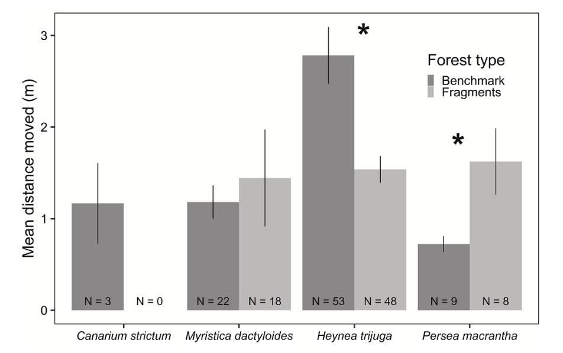
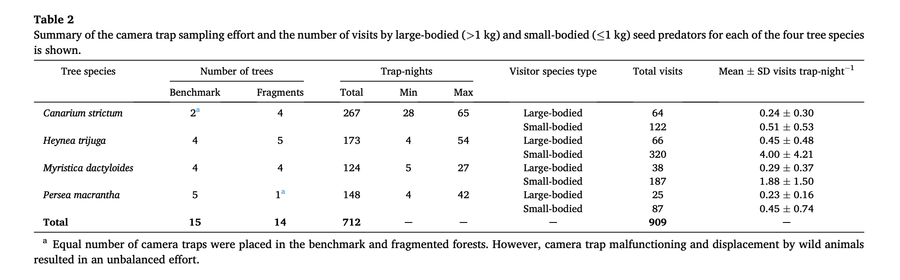

```{r setup, include=FALSE}
knitr::opts_chunk$set(echo = TRUE)
```

<br>

### Loading the Required Packages
```{r message=FALSE, warning=FALSE}
library(readr)
library(ggplot2)
library(dplyr)
library(shiny)
library(tidyverse)
```

<br>

# Introduction
The published article, "Seed fates of four rainforest tree species in the fragmented forests of Anamalais in the southern Western Ghats, India" by Abhishek Gopala, Divya Mudappa, TR Shankar Raman, Rohit Naniwadekar publishes data on the seed fates of four different tree species in fragmented forests in India. The tree species include: Canarium strictum, Heynea trijuga, Myristica dactyloides, and Persea macrantha. In the article, it describes how seed predation is key in controlling plant population and the structure within forests. Forest fragmentation and habitat loss is directly correlated with seed predation and altered tree recruitment. This article examines four different rainforest tree species and the influence of forest type: benchmark N=3, fragmented N=5, and seed size on the proportion of seeds: 1) predated by vertebrate seed predators, 2) predated by invertebrate seed predators, and 3) removed by vertebrate seed predators. The seeds were tracked by putting seeds in four 1x1 meter plots under each canopy type. Camera traps were placed under a subset of trees N=29 and there was a total of N=712 trap nights. Nine species of seed predators was recorded and it is noted that they differed between tree species. This study brings forth the idea that seed predation can alter regeneration patterns and alter adult tree communities in fragmented forests. 


<br>

# Replication of a Figure 

### The Figure Being Replicated 


<br>

### Loading in the Data Set 
```{r}
my_data <- read_csv("/Users/lilyholden/Documents/GitHub/holdenl-data-replication-assignment/Distance_moved.csv", show_col_types = FALSE)
head(my_data)
```
<br>

### Organizing The Data Set with Piping 
```{r}
#Add Columns that Expresses Mean, Standard Deviation, Standard Error, Upper Limit, and Lower Limit and Organizes it by Tree Species and Forest Type
new_data <- my_data %>%  
  group_by(Tree_sp, Forest_type) %>%  
  summarize(Distance_moved_means=mean(Distance_moved_m), sd_Distance_moved=sd(Distance_moved_m),  
            N_N=n(),  
            se=sd_Distance_moved/sqrt(N_N),  
            upper_limit=Distance_moved_means+se,  
            lower_limit=Distance_moved_means-se
  )  
head(new_data)
```
<br>

### Seting the  Upper Limit and Lower Limit within the Data Set Are in Order to Plot Error Bars 
```{r}
upper_limit <- new_data$upper_limit
lower_limit <- new_data$lower_limit
```

<br>

### Plotting the Data
```{r warning=FALSE}
g <- ggplot() + 
geom_col(data = new_data, mapping = aes(x = Tree_sp, y = Distance_moved_means, group=Forest_type, fill = Forest_type), colour = "black", position = "dodge") +
geom_errorbar(data = new_data, aes(x=Tree_sp, ymin = lower_limit, ymax = upper_limit, fill= Forest_type), width=.2, position=position_dodge(.9)) 
g
```

<br>

# Replicating A Descriptive Statistical Analysis



<br>

### Loading in the Data
```{r}
data <- read_csv("/Users/lilyholden/Documents/GitHub/holdenl-data-replication-assignment/Visits_seedpredators_CT.csv", show_col_types = FALSE)
head(data)
```
<br>

### Organizing The Data Set with Piping

Because each column of data is organized differently, each column will need to be extracted individually: 

<br>

#### Piping to Find the Total Number of Benchmark and Fragment Trees that Contain Camera Traps Per Tree Species
```{r}
dataIII <- 
  data %>%
  group_by(Tree_sp, Forest_type) %>%
  summarize(Number_of_trees = n_distinct(Tree_id))
dataIII
```

<br>

#### Piping to Find the Maximum Number of Visits of Seed Predators in a Night per Tree Species
```{r}
dataIIII <- 
  data %>%
  group_by(Tree_sp) %>%
  summarize(Max = max(CT_trap_nights, na.rm=TRUE))
dataIIII
```

<br>

#### Piping to Find the Minimum Number of Visits of Seed Predators in a Night per Tree Species
```{r}
dataV <- 
  data %>%
  group_by(Tree_sp) %>%
  summarize(Min = min(CT_trap_nights, na.rm=TRUE))
dataV
```

<br>

#### Piping to Find the Total Visits for Large (>1 kg) and Small Bodied (<1kg) Seed Predators per Tree Species 
```{r}
dataVI <- 
  data %>%
  group_by(Tree_sp, Body_size) %>%
  summarize(Total_visits=sum(Num_visits))
dataVI
```

<br>

#### Piping to Find the Total Number of Seed Predators per Tree Species
```{r}
dataVII <- 
  data %>%
  group_by(Tree_sp) %>%
  summarize(Total=sum(unique(CT_trap_nights)))
dataVII
```
Canarium and Persea match what was presented in the paper, but Heynea and Myristica do not, for some reason. 

<br>

### Merging Some of The Organized Data -- might not include or explain why it doesn't really work... 
```{r}
v <- merge(dataIII, dataIIII)
v
```

```{r}
w <- merge(v, dataV)
w
```

<br>

# GLMM Replication  

```{r message=FALSE, warning=FALSE}
library(lme4) #load the lme4 package to use the glmer() function
```

<br>

### Results of the GLMM Being Replicated

#### A GLMM with a poisson error structure examining the influence of forest type on the visitations of seed predators with tree species as a random variable was run using the offset() function to account for variable trap nights. 


<br>

#### Piping to Determine the Number of Visits Based Tree Species and Forest Type
```{r}
glmmdata <- 
data %>%
  group_by(Tree_sp, Forest_type) %>%
  reframe(Num_visits)
glmmdata
```
<br>

In order to get the offset() function to work properly, I had to turn CT_trap_nights into a separate vector. 

<br>

```{r}
Trap_nights <- data$CT_trap_nights
Trap_nights
```

<br>

### Replicating the GLMM


```{r warning=FALSE}
glmmI <- glmer(Num_visits~Forest_type + offset(log(Trap_nights)) + (1|Tree_sp), data=glmmdata, family = poisson(link = "log"))
summary(glmmI)
```

<br>

#### Determine the Marginal and Conditional R2 for the GLMM
```{r warning=FALSE}
#install.packages("performance")
library(performance)
r2_nakagawa(glmmI) #use r2_nakagawa package to find the marginal and conditional R2 values
```

The marginal R2 for the mixed model is the same as published in the paper, however the conditional is not. 

<br>

#### Determine the Confidence Intervals for the GLMM
```{r}
confint(glmmI) #use confint to find the confidence intervals of the glmm
```
<br>

#### References
https://www.sciencedirect.com/science/article/pii/S1146609X20301909 <br>
https://www.stat.umn.edu/geyer/5931/mle/seed2.pdf <br>
https://fuzzyatelin.github.io/bioanth-stats/modules.html <br>
https://stackoverflow.com/questions/13050516/how-to-make-dodge-in-geom-bar-agree-with-dodge-in-geom-errorbar-geom-point <br>
